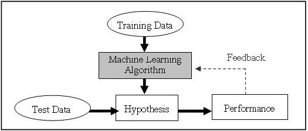

# Machine Learning

- Machine Learning finds patterns in (big) data that useful for researchers and are not visible from human point of view.

- Machine Learning implies an algorithmic model that describes a certain process and its issues, makes predictions for the subject for the model (real world systems), and self-adjusts. Derived model provides recommendations/insights and monitors the results once those recommendations are implemented.

- The acquired results contributes to improve the model. See the following picture, the _Feedback_ dotted branch demonstrating Machine Learning drastically differ from the plain data analysis:

- Machine Learning or Artificial Intelligence compared to Data Mining is more on incorporating acquired knowledge into the framework for further (i.e future) use in analysis.

[Image Source](http://scraping.pro/data-analytics-data-analysis-data-mining-data-science-machine-learning-big-data/)

## Machine Learning Tasks

Machine learning tasks are typically classified into three broad categories, depending on the nature of the learning "signal" or "feedback" available to a learning system.

- Supervised learning: The computer is presented with example inputs and their desired outputs, given by a "teacher", and the goal is to learn a general rule that maps inputs to outputs.
- Unsupervised learning: No labels are given to the learning algorithm, leaving it on its own to find structure in its input. Unsupervised learning can be a goal in itself (discovering hidden patterns in data) or a means towards an end (feature learning).
- Reinforcement learning: A computer program interacts with a dynamic environment in which it must perform a certain goal (such as driving a vehicle or playing a game against an opponent[4]:3). The program is provided feedback in terms of rewards and punishments as it navigates its problem space.

[[Download a PDF version](https://github.com/rasbt/pattern_classification/raw/master/PDFs/supervised_learning_flowchart.pdf)] of this flowchart.

* [Machine learning overview](http://usblogs.pwc.com/emerging-technology/a-look-at-machine-learning-infographic/)
* [Machine learning methods](http://usblogs.pwc.com/emerging-technology/machine-learning-methods-infographic/)
* [Machine learning evolution](http://usblogs.pwc.com/emerging-technology/machine-learning-evolution-infographic/)

 

 
 
 

 
